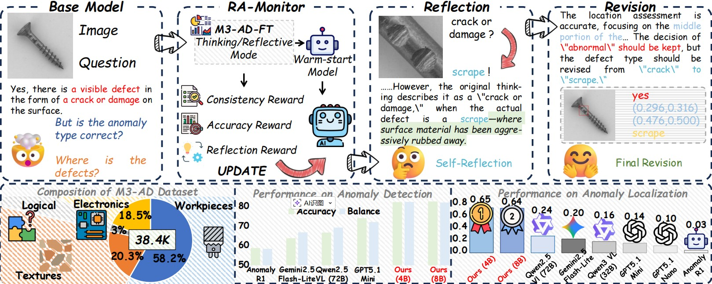
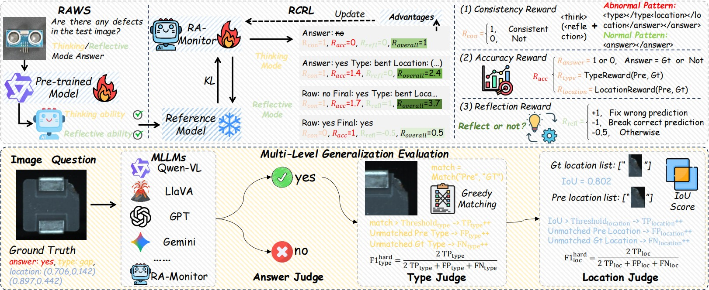
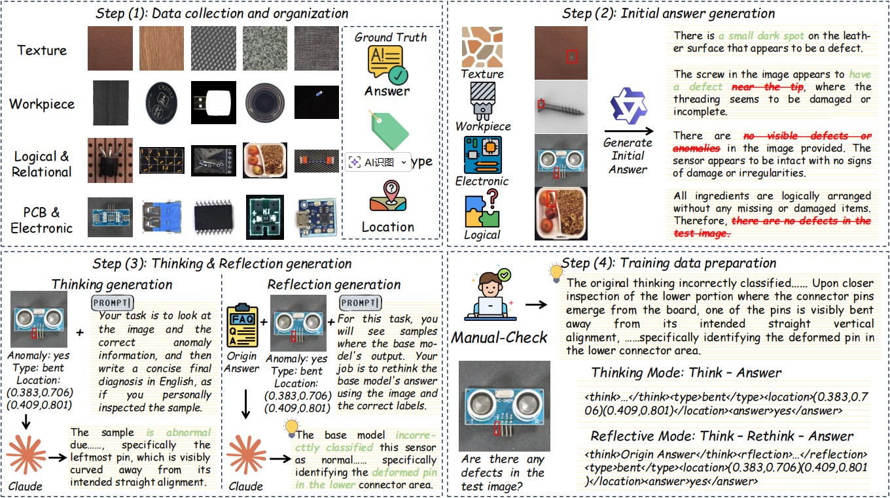
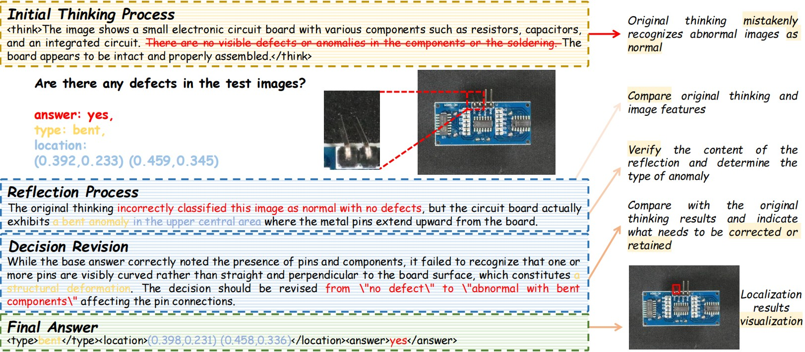

# M3-AD: Reflection-aware Multi-modal, Multi-category, and Multi-dimensional Benchmark and Framework for Industrial Anomaly Detection
M3-AD enables self-correction of unreliable initial predictions through a reflection-aware mechanism, significantly improving
anomaly type recognition and spatial localization in industrial anomaly detection compared to base models.

## RA-Monitor 🔗 Model Weights
- RA-Monitor-4B: [Download](https://huggingface.co/yanhui01/RA-Monitor/tree/main/RA-Monitor(Qwen3-VL-4B))
- RA-Monitor-8B: [Download](https://huggingface.co/yanhui01/RA-Monitor/tree/main/RA-Monitor(Qwen3-VL-8B))

Overview of RA-Monitor. RAWS equips the pre-trained model with both thinking and reflective abilities, while RCRL further
optimizes the model via consistency, accuracy, and reflection rewards. The lower part illustrates the unified metric computation used for
multi-level evaluation of anomaly detection, type recognition, and localization.

## Paper

## M3-AD
### M3-AD-FT
Overview of M3-AD-FT data construction pipeline. The pipeline consists of four stages: (1) collecting and organizing industrial
images across multiple scenarios with structured anomaly annotations; (2) classifying data by scenario and generating initial model
answers; (3) constructing thinking and reflective captions; (4) preparing training data through manual verification.

### M3-AD-Bench

## Case Study
Case study of RA-Monitor output.

